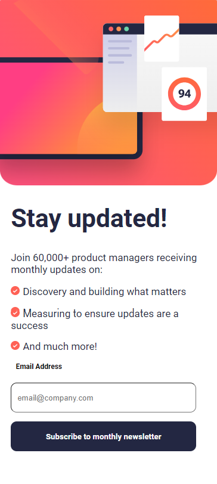
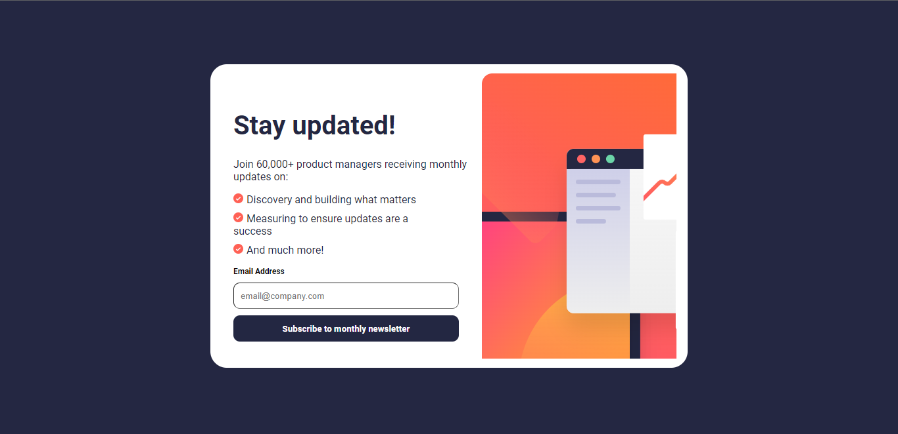

# Frontend Mentor - Newsletter sign-up form with success message solution

## Table of contents

- [Overview](#overview)
  - [The challenge](#the-challenge)
  - [Screenshot](#screenshot)
  - [Links](#links)
- [My process](#my-process)
  - [Built with](#built-with)
  - [What I learned](#what-i-learned)
  - [Continued development](#continued-development)
- [Author](#author)

## Overview

### The challenge

Users should be able to:

- Add their email and submit the form
- See a success message with their email after successfully submitting the form
- See form validation messages if:
  - The field is left empty
  - The email address is not formatted correctly
- View the optimal layout for the interface depending on their device's screen size
- See hover and focus states for all interactive elements on the page

### Screenshot

### Links

- Solution URL: [project Link](https://github.com/Precious-c/Frontend-Projects/tree/main/newsletter-signup))
- Live Site URL: [Live Link](https://newsletter-signup-precious.vercel.app)

## My process

### Built with

- Semantic HTML5 markup
- CSS custom properties
- Flexbox

### What I learned

While working on this project I learnt more about form validation using Javascript and making my website reponsive with media queries.

### Continued development

I hope to work more on the responsiveness of the site and also the form validation in the future

## Author

- Website - [Amaechi Precious](amaechiprecious.netlify.app)
- Frontend Mentor - [@precious-c](https://www.frontendmentor.io/profile/Precious-c)
- Twitter - [@maziryder](https://www.twitter.com/maziryder)
